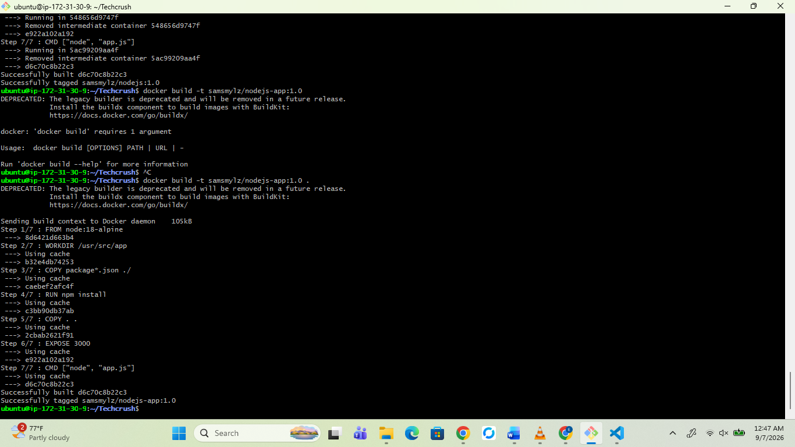
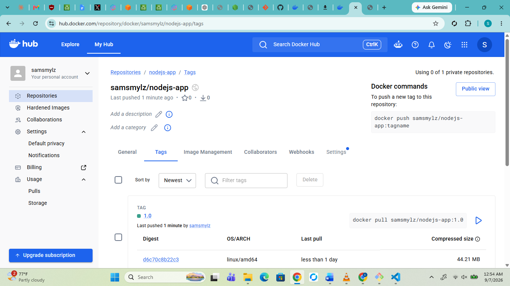
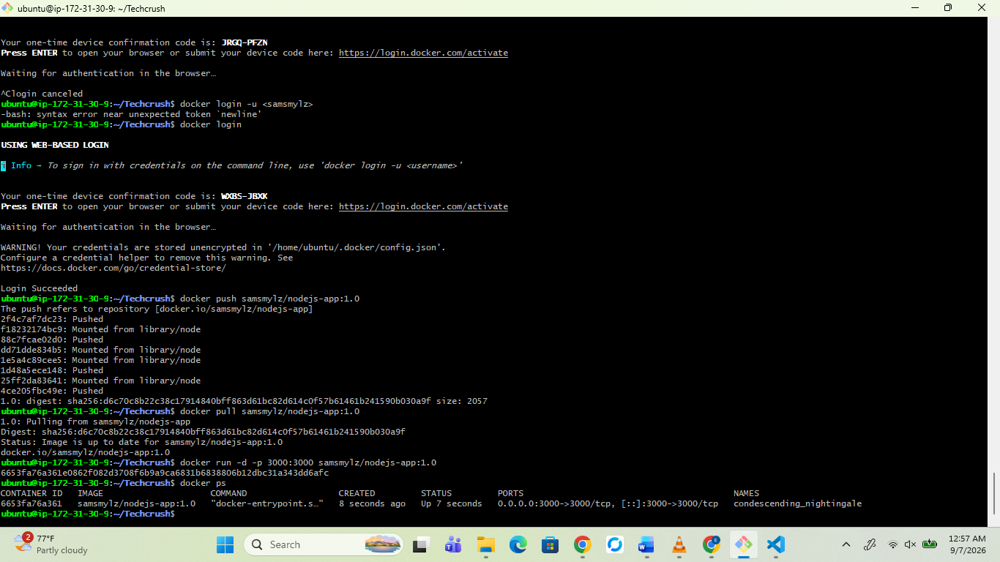
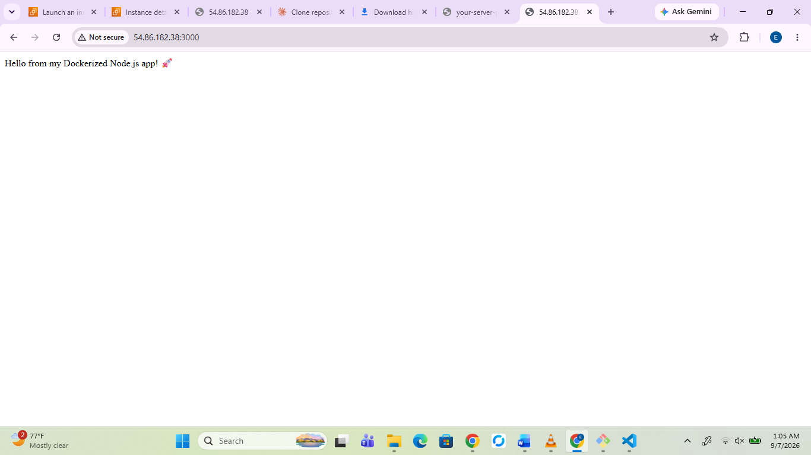

# Node.js Docker Deployment

Simple Node.js app containerized with Docker and deployed via Docker Hub.

## Run locally
npm install
node app.js

## Docker
docker build -t samsmylz/nodejs-app:1.0 .
docker run -d -p 3000:3000 samsmylz/nodejs-app:1.0

## Screenshots
### Docker Build

### Docker Hub

### Running Container

### Live App
